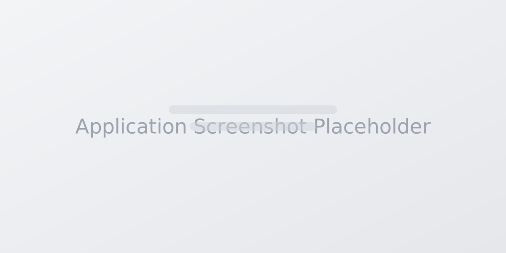

# Task Management Dashboard

A modern, responsive task management dashboard built with React, Vite, Tailwind CSS, and Zustand.



## Features

- **Authentication**: Mock login with persistence.
- **Task Board**: 3-column Kanban layout (Todo, In Progress, Completed).
- **Task Management**: Create, Read, Update, Delete (CRUD) tasks.
- **Search & Filter**: Real-time task filtering.
- **Responsive Design**: Optimized for mobile and desktop.
- **Dark Mode**: System-aware and manual toggle preference.

## Tech Stack

- **Frontend**: React 19 (Vite)
- **Language**: TypeScript
- **Styling**: Tailwind CSS v4 (via `@tailwindcss/vite` plugin)
- **State Management**: Zustand (with Persist middleware)
- **Routing**: React Router DOM v6
- **Icons**: Heroicons & React Icons

## Setup Instructions

1.  **Install Dependencies**
    ```bash
    npm install
    ```

2.  **Start Development Server**
    ```bash
    npm run dev
    ```

3.  **Build for Production**
    ```bash
    npm run build
    ```

## Architecture

The project follows a feature-based and layout-centric directory structure:

```
src/
├── components/
│   ├── board/       # Kanban board specific components (Column, Card)
│   ├── layout/      # Application shell (Sidebar, Navbar)
│   └── ui/          # Reusable primitives (Modal, Button, Input)
├── hooks/           # Custom React hooks (useDebounce)
├── layouts/         # Route wrapper layouts (AuthLayout, DashboardLayout)
├── pages/           # Page components (Dashboard, Login, Settings)
├── store/           # Global state management (Zustand)
└── styles/          # Global styles and Tailwind configuration
```

### Key Design Decisions

- **State Management**: **Zustand** was chosen over Context API or Redux for its simplicity, minimal boilerplate, and built-in persistence middleware.
- **Styling**: **Tailwind CSS v4** provides a utility-first approach that ensures design consistency and rapid development.
- **Build Tool**: **Vite** offers a lightning-fast dev server and optimized production builds.

## Tradeoffs

- **Mock Backend**: For this frontend-focused task, we use a mock authentication system and local storage persistence. reliable for a demo but would be replaced by a real API in production.
- **Client-Side Filtering**: Search and filter operations happen on the client side. This is performant for small datasets but would ideally move to the server for large-scale applications.

## Future Improvements

- [ ] **Backend Integration**: Connect to a real REST or GraphQL API.
- [ ] **Drag & Drop**: Implement `dnd-kit` or `react-beautiful-dnd` for dragging tasks between columns.
- [ ] **Unit Tests**: Add Jest and React Testing Library for component testing.
- [ ] **CI/CD**: Set up GitHub Actions for automated testing and deployment.

## License

MIT
